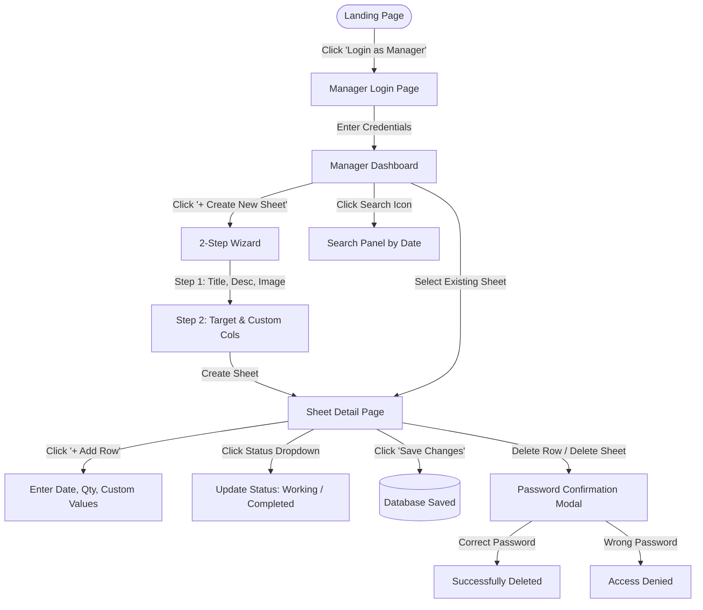
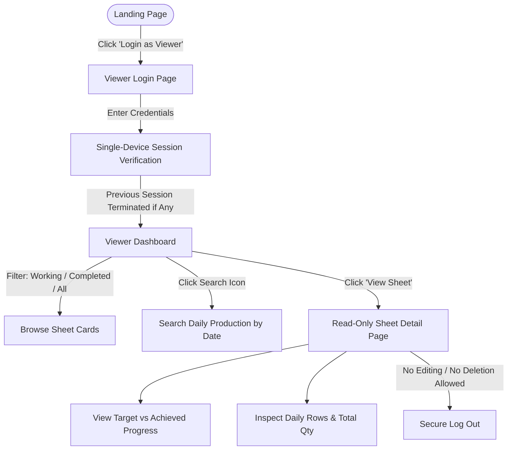

# 🏭 Production Portal — Workflow Guide (कार्यप्रणाली निर्देशिका)

> यह दस्तावेज़ **Production Portal** में **Production Manager** और **Viewer** दोनों के पूरे वर्कफ़्लो (काम करने के तरीके) को बिल्कुल आसान और स्पष्ट भाषा में समझाता है।

---

## 📌 1. संक्षिप्त परिचय (Overview)

Production Portal एक **MERN-stack** वेब एप्लिकेशन है जिसका मुख्य उद्देश्य फैक्ट्री / यूनिट के रोज़ाना के प्रोडक्शन डेटा (Daily Production Data) को ट्रैक करना और मॉनिटर करना है।

इस पोर्टल में दो प्रकार के यूज़र्स (Roles) होते हैं:

| यूज़र रोल (Role) | भूमिका (Role Description) | एक्सेस का प्रकार (Access Type) |
| :--- | :--- | :--- |
| **👔 Production Manager** | प्रोडक्शन डेटा एंट्री, नई शीट्स बनाना, स्टेटस बदलना, डेटा एडिट और डिलीट करना | **Full Access (Read + Write + Delete)** |
| **👁️ Viewer** | रोज़ाना का प्रोडक्शन केवल देखना, प्रोग्रेस और रिपोर्ट्स चेक करना | **Read-Only (केवल देखने की अनुमति)** |

---

## 👔 2. Production Manager का पूरा वर्कफ़्लो (Step-by-Step)

Production Manager का काम नई प्रोडक्शन शीट्स बनाना, हर रोज़ का काम दर्ज करना, स्टेटस अपडेट करना और डेटा की निगरानी करना होता है।

### 🔹 Step 1: लॉगिन (Login)
1. पोर्टल के होम/लैंडिंग पेज (`/landing`) पर जाएं।
2. **"Login as Manager"** बटन पर क्लिक करें।
3. अपना **User ID** और **Password** दर्ज करें और **"Login Securely"** पर क्लिक करें।
4. सफल लॉगिन के बाद आप सीधे **Manager Dashboard** (`/manager/home`) पर पहुंच जाएंगे।

---

### 🔹 Step 2: डैशबोर्ड और शीट्स का ओवरव्यू (Dashboard Overview)
डैशबोर्ड पर मैनेजर को सभी शीट्स कार्ड फॉर्मेट में दिखती हैं:
- **फ़िल्टर टैब्स (Filters):**
  - `All` — सभी शीट्स देखें
  - `Working` — जिन पर अभी काम चल रहा है
  - `Completed` — जो प्रोडक्शन पूरा हो चुका है
  - `Upcoming` — जो काम आगे शुरू होना है
- **शीट कार्ड की जानकारी:**
  - शीट का नाम (Title) और कवर इमेज (Cover Image)
  - वर्तमान स्टेटस (Upcoming / Working / Completed)
  - कुल लक्ष्य (Target Quantity) बनाम अब तक बना माल (Achieved Quantity)
  - प्रोग्रेस बार (Progress Bar) और प्रतिशत (%)
  - अंतिम अपडेट की तारीख (Last Updated Date)

---

### 🔹 Step 3: नई प्रोडक्शन शीट बनाना (Create New Sheet)
डैशबोर्ड पर ऊपर दाईं ओर **"+ Create New Sheet"** बटन पर क्लिक करें। एक 2-स्टेप विज़ार्ड खुलेगा:

#### **Step 1: बुनियादी जानकारी (Basic Information)**
1. **Sheet Title (\*ज़रूरी):** प्रोडक्ट या लॉट का नाम डालें (उदा. *Cotton Shirt Batch #102*).
2. **Sheet Description (वैकल्पिक):** शीट के बारे में संक्षिप्त विवरण (अधिकतम 300 अक्षर).
3. **Sheet Image (वैकल्पिक):** प्रोडक्ट की फ़ोटो अपलोड करें (फ़ाइल चुनें या URL डालें).
4. **"Next →"** बटन पर क्लिक करें।

#### **Step 2: टार्गेट और कस्टम कॉलम्स (Target & Columns)**
1. **Target Quantity:** इस शीट के तहत कुल कितने पीस बनाने हैं (उदा. *5000*).
2. **Additional Columns (A, B, C...):**
   - पहले से मौजूद डिफ़ॉल्ट कॉलम्स: `Date`, `Quantity`, `Description` (यह अपने आप रहते हैं).
   - अगर अतिरिक्त कॉलम्स चाहिए (जैसे *Color*, *Size*, *Operator Name*, *Shift* आदि), तो `+` और `−` बटन दबाकर कॉलम्स की संख्या (0 से 26 तक) चुनें।
   - आप हर कॉलम को अपना नाम भी दे सकते हैं (जैसे 'A' को 'Size', 'B' को 'Color' आदि).
3. **"Create Sheet →"** पर क्लिक करें। शीट तुरंत तैयार हो जाएगी और आप सीधे उस शीट के डिटेल पेज पर चले जाएंगे।

---

### 🔹 Step 4: रोज़ाना का डेटा दर्ज करना (Daily Data Entry)
शीट डिटेल पेज (`/sheet/:id`) पर:

1. **नई रो जोड़ना (Add Row):**
   - ऊपर दिए गए **"+ Add Row"** बटन पर क्लिक करें।
   - टेबल में सबसे नीचे एक नई खाली पंक्ति जुड़ जाएगी।
2. **डेटा भरना (Fill Data):**
   - **Date:** तारीख चुनें (डिफ़ॉल्ट आज की तारीख रहती है).
   - **Qty:** उस दिन बने कुल पीस (Quantity) दर्ज करें.
   - **Description:** काम से जुड़ी टिप्पणी लिखें (उदा. *Shift-A Production*).
   - **Custom Columns:** अतिरिक्त कॉलम्स की जानकारी भरें (उदा. Size: *L*, Color: *Blue*).
3. **कॉलम का नाम बदलना (Rename Column):**
   - टेबल के हेडर में किसी भी कस्टम कॉलम पर क्लिक करके उसका नाम कभी भी बदला जा सकता है।
4. **बदलाव सेव करना (Batch Save):**
   - जब आप डेटा दर्ज या एडिट करते हैं, तो ऊपर **"Save Changes"** का बटन हाइलाइट हो जाता है।
   - **"Save Changes"** पर क्लिक करते ही सारा डेटा एक साथ डेटाबेस में सुरक्षित हो जाता है।
   - *नोट:* यदि आप बिना सेव किए पेज छोड़ने की कोशिश करेंगे, तो सिस्टम आपको चेतावनी (Warning) देगा।

---

### 🔹 Step 5: स्टेटस और डिटेल्स अपडेट करना (Updating Status & Details)
- **Status बदलना:** पेज के ऊपर दिए गए स्टेटस ड्रॉपडाउन से स्थिति बदलें:
  - `Upcoming` ➔ काम अभी शुरू नहीं हुआ है
  - `Working` ➔ प्रोडक्शन चालू है
  - `Completed` ➔ लक्ष्य पूरा हो गया है
- **विवरण बदलना (Edit Description):** पेंसिल (Edit) आइकन पर क्लिक करके शीट का विवरण कभी भी बदल सकते हैं।
- **फ़ोटो बदलना (Change Image):** कैमरा/इमेज आइकन पर क्लिक करके शीट की फ़ोटो बदल या हटा सकते हैं।

---

### 🔹 Step 6: सुरक्षा और डिलीट प्रक्रिया (Password-Protected Deletion)
डेटा की सुरक्षा के लिए पोर्टल में किसी भी आकस्मिक डिलीट (Accidental Deletion) से बचाव की व्यवस्था है:
- **पूरी शीट डिलीट करना:** जब मैनेजर शीट डिलीट करने के लिए ट्रैश आइकन पर क्लिक करता है, तो सिस्टम **मैनेजर का लॉगिन पासवर्ड** मांगता है। सही पासवर्ड डालने पर ही शीट डिलीट होगी।
- **कोई रो डिलीट करना:** किसी खास दिन की एंट्री डिलीट करने पर भी **मैनेजर का पासवर्ड** अनिवार्य है। बिना पासवर्ड के डेटा डिलीट नहीं हो सकता।

---

### 🔹 Step 7: तारीख के अनुसार सर्च (Date Search)
- हेडर में दिए गए **Search (मैग्निफ़ाइंग ग्लास) आइकन** पर क्लिक करें।
- **Today** या **Yesterday** पर तुरंत क्लिक करें, या कैलेंडर से कोई भी तारीख चुनें।
- उस तारीख को सभी शीट्स में कुल कितना प्रोडक्शन हुआ, उसकी पूरी लिस्ट एक जगह दिख जाएगी।

---

## 👁️ 3. Viewer का पूरा वर्कफ़्लो (Step-by-Step)

Viewer रोल कंपनी के मालिकों, क्लाइंट्स, इंस्पेक्टर्स या सुपरवाइज़र्स के लिए है, जिन्हें केवल प्रोडक्शन की स्थिति देखनी होती है।

### 🔹 Step 1: लॉगिन (Login)
1. पोर्टल के होम पेज (`/landing`) पर जाएं।
2. **"Login as Viewer"** बटन पर क्लिक करें।
3. Viewer का **User ID** और **Password** दर्ज करें।
4. सफल लॉगिन के बाद **Viewer Dashboard** (`/viewer/home`) खुल जाएगा।

---

### 🔹 Step 2: व्यूअर डैशबोर्ड (Viewer Dashboard)
- व्यूअर को होम पेज पर सीधे **'Working'** शीट्स (चालू काम) प्राथमिकता के साथ दिखती हैं।
- व्यूअर `All`, `Working`, `Completed`, `Upcoming` टैब्स पर क्लिक करके फ़िल्टर कर सकते हैं।
- हर कार्ड पर स्पष्ट रूप से दिखता है:
  - कुल टार्गेट कितना था (Target)
  - अब तक कितना माल तैयार हो चुका है (Achieved)
  - प्रोग्रेस बार और काम का प्रतिशत (%)
  - शीट की अंतिम अपडेट तारीख
- किसी भी शीट की विस्तृत रिपोर्ट देखने के लिए **"View Sheet →"** बटन पर क्लिक करें।

---

### 🔹 Step 3: शीट का विस्तृत डेटा देखना (Viewing Sheet Details)
शीट डिटेल पेज (`/sheet/:id`) पर व्यूअर को:
- पूरी प्रोडक्शन टेबल साफ़-सुथरे स्प्रेडशीट फॉर्मेट में दिखती है।
- हर तारीख का अलग-अलग उत्पादन (Date, Qty, Description, Custom Columns) दिखाई देता है।
- टेबल के सबसे नीचे कुल जोड़ (**TOTAL**) स्पष्ट रूप से हाइलाइट रहता है।
- **सुरक्षा (Read-Only Guarantee):**
  - व्यूअर किसी भी सेल, टेक्स्ट या नंबर को बदल नहीं सकता।
  - व्यूअर को कोई 'Edit', 'Add Row', या 'Delete' का विकल्प नहीं दिखता।

---

### 🔹 Step 4: तारीख के अनुसार प्रोडक्शन खोजना (Date Search)
- व्यूअर भी हेडर में **Search आइकन** का उपयोग करके किसी भी तारीख (जैसे *आज* या *कल*) का कुल प्रोडक्शन एक क्लिक में देख सकते हैं।

---

### 🔹 Step 5: सिंगल-डिवाइस सुरक्षा फ़ीचर (Single-Device Session Enforcement) ⚡
Viewer अकाउंट के लिए पोर्टल में एक विशेष सुरक्षा नियम लागू है:
> **एक समय में एक ही डिवाइस पर लॉगिन:**
> अगर एक Viewer किसी मोबाइल या लैपटॉप पर लॉगिन है, और कोई दूसरा व्यक्ति उसी आईडी-पासवर्ड से किसी अन्य डिवाइस पर लॉगिन करता है, तो **पहले वाले डिवाइस का सेशन तुरंत बंद (Logout) हो जाएगा**।
> इससे अनाधिकृत शेयरिंग और डेटा मिसयूज से पूरी सुरक्षा मिलती है।

---

## 🔄 4. वर्कफ़्लो डायग्राम्स (Visual Workflows)

### 📊 Production Manager वर्कफ़्लो

---

### 📊 Viewer वर्कफ़्लो

---

## 📋 5. तुलना तालिका (Manager vs Viewer Feature Matrix)

| फ़ीचर (Feature) | Production Manager | Viewer | विवरण |
| :--- | :---: | :---: | :--- |
| **लॉगिन एक्सेस** | ✅ | ✅ | अलग-अलग रोल आधारित लॉगिन |
| **डैशबोर्ड और प्रोग्रेस देखना** | ✅ | ✅ | कार्ड्स, स्टेटस, प्रतिशत बार |
| **नई शीट बनाना** | ✅ | ❌ | केवल मैनेजर बना सकता है |
| **शीट स्टेटस बदलना** | ✅ | ❌ | Upcoming / Working / Completed |
| **रोज़ाना डेटा (Rows) जोड़ना** | ✅ | ❌ | केवल मैनेजर एंट्री कर सकता है |
| **मौजूदा डेटा एडिट करना** | ✅ | ❌ | इनलाइन एडिटिंग सुविधा |
| **शीट या रो डिलीट करना** | ✅ (पासवर्ड सहित) | ❌ | आकस्मिक डिलीट रोकने के लिए पासवर्ड अनिवार्य |
| **तारीख के अनुसार सर्च करना** | ✅ | ✅ | कल, आज या किसी भी तारीख का उत्पादन देखना |
| **सिंगल-डिवाइस सेशन नियम** | ❌ (मल्टीपल डिवाइस मान्य) | ✅ (सख्त 1 डिवाइस नियम) | व्यूअर क्रेडेंशियल शेयरिंग की रोकथाम |
| **कवर फोटो और विवरण अपडेट** | ✅ | ❌ | इमेज अपलोड या रिमूव करना |

---

## 💡 6. मुख्य सावधानियां और उपयोगी टिप्स (Important Tips)

1. **डेटा सेव करना न भूलें (Manager):** जब भी आप टेबल में कोई रो जोड़ें या किसी सेल का डेटा बदलें, तो ऊपर दिखाई दे रहे नीले **"Save Changes"** बटन को अवश्य दबाएं।
2. **पासवर्ड याद रखें (Manager):** किसी भी रो या शीट को डिलीट करने के लिए आपके लॉगिन पासवर्ड की आवश्यकता होती है। इसे सुरक्षित रखें।
3. **व्यूअर सेशन का ध्यान रखें (Viewer):** यदि व्यूअर किसी नए फ़ोन या ब्राउज़र में लॉगिन करेगा, तो पुराने डिवाइस से स्वतः लॉगआउट हो जाएगा। काम पूरा होने पर सुरक्षित लॉगआउट करें।
4. **सर्च टूल का उपयोग (Both):** रोज़ शाम को पूरे कारखाने का कुल उत्पादन देखने के लिए सर्च पैनल में जाकर **'Today'** बटन दबाएं; उस दिन का सारा काम एक साथ दिखाई देगा।
