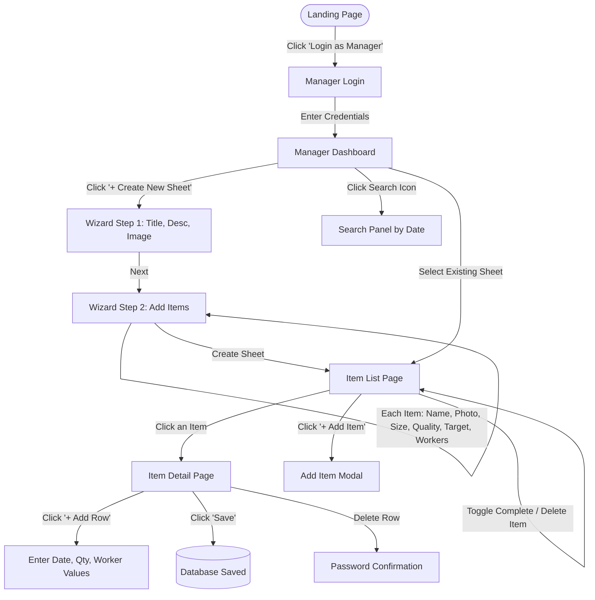
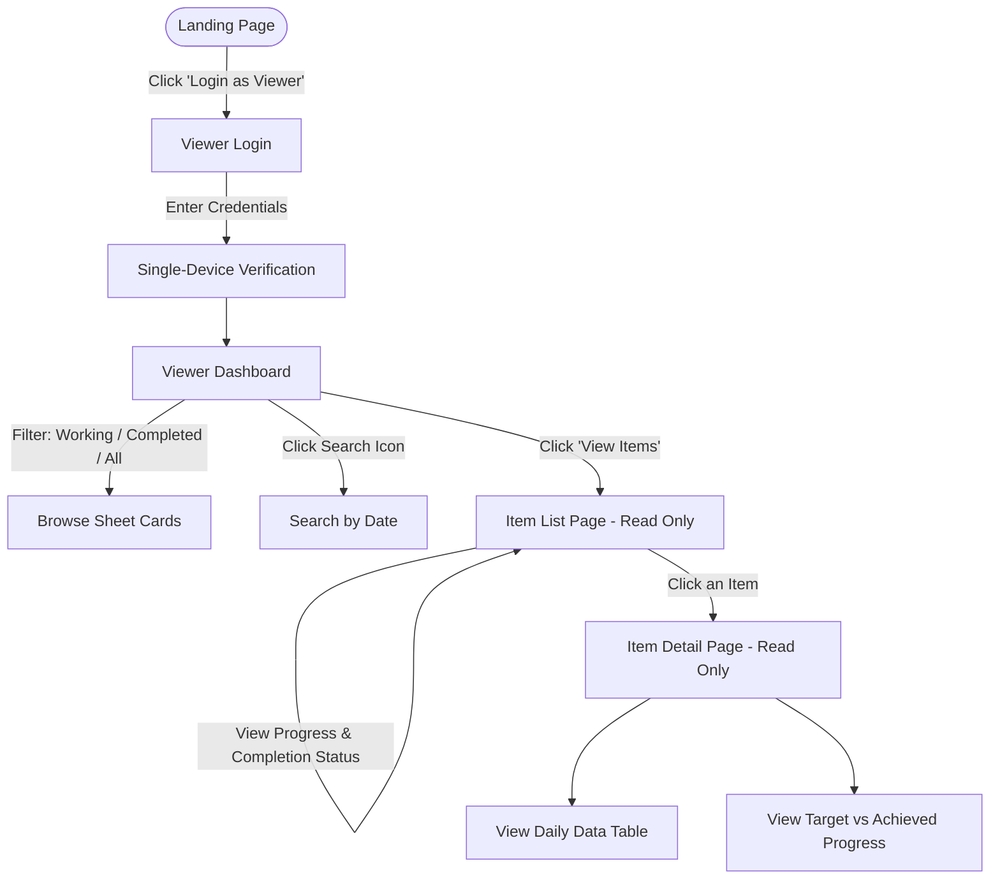

# 🏭 Production Portal — Workflow Guide (कार्यप्रणाली निर्देशिका)

> यह दस्तावेज़ **Production Portal** में **Production Manager** और **Viewer** दोनों के पूरे वर्कफ़्लो (काम करने के तरीके) को बिल्कुल आसान और स्पष्ट भाषा में समझाता है।

---

## 📌 1. संक्षिप्त परिचय (Overview)

Production Portal एक **MERN-stack** वेब एप्लिकेशन है जिसका मुख्य उद्देश्य फैक्ट्री / यूनिट के रोज़ाना के प्रोडक्शन डेटा (Daily Production Data) को ट्रैक करना और मॉनिटर करना है।

इस पोर्टल की **नई आर्किटेक्चर** इस प्रकार है:
```
Sheet (शीट) → Items (आइटम्स) → Rows (रोज़ाना डेटा एंट्रीज़)
```

| यूज़र रोल (Role) | भूमिका (Role Description) | एक्सेस का प्रकार (Access Type) |
| :--- | :--- | :--- |
| **👔 Production Manager** | शीट बनाना, आइटम्स जोड़ना, रोज़ाना का डेटा एंट्री, स्टेटस बदलना, डिलीट करना | **Full Access (Read + Write + Delete)** |
| **👁️ Viewer** | शीट्स, आइटम्स और उनका प्रोडक्शन डेटा केवल देखना | **Read-Only (केवल देखने की अनुमति)** |

---

## 👔 2. Production Manager का पूरा वर्कफ़्लो (Step-by-Step)

### 🔹 Step 1: लॉगिन (Login)
1. पोर्टल के होम/लैंडिंग पेज (`/landing`) पर जाएं।
2. **"Login as Manager"** बटन पर क्लिक करें।
3. अपना **User ID** और **Password** दर्ज करें और **"Login Securely"** पर क्लिक करें।
4. सफल लॉगिन के बाद आप सीधे **Manager Dashboard** (`/manager/home`) पर पहुंच जाएंगे।

---

### 🔹 Step 2: डैशबोर्ड और शीट्स का ओवरव्यू (Dashboard Overview)
डैशबोर्ड पर मैनेजर को सभी शीट्स कार्ड फॉर्मेट में दिखती हैं:
- **फ़िल्टर टैब्स (Filters):** `All`, `Working`, `Completed`, `Upcoming`
- **शीट कार्ड की जानकारी:**
  - शीट का नाम (Title) और कवर इमेज (Cover Image)
  - वर्तमान स्टेटस (Upcoming / Working / Completed)
  - कुल आइटम्स और कितने पूरे हो गए (e.g. "3/5 items done")
  - कुल लक्ष्य बनाम अब तक बना माल (e.g. "2,500/10,000 pcs") + प्रोग्रेस बार
  - अंतिम अपडेट की तारीख

---

### 🔹 Step 3: नई प्रोडक्शन शीट बनाना (Create New Sheet)
डैशबोर्ड पर **"+ Create New Sheet"** बटन पर क्लिक करें। एक 2-स्टेप विज़ार्ड खुलेगा:

#### **Step 1: बुनियादी जानकारी (Basic Information)**
1. **Sheet Title (\*ज़रूरी):** प्रोडक्ट या लॉट का नाम डालें (उदा. *Cotton Shirt Order #102*).
2. **Sheet Description (वैकल्पिक):** शीट के बारे में संक्षिप्त विवरण (अधिकतम 300 अक्षर).
3. **Sheet Image (वैकल्पिक):** प्रोडक्ट की फ़ोटो अपलोड करें।
4. **"Next → Add Items"** बटन पर क्लिक करें।

#### **Step 2: आइटम्स जोड़ना (Add Items)**
यहाँ आप शीट में कौन-कौन से आइटम्स (प्रोडक्ट्स) होंगे, उनकी डिटेल भरेंगे। हर आइटम के लिए:
1. **Item Name (\*ज़रूरी):** आइटम का नाम (उदा. *White Shirt L*, *Blue Shirt XL*).
2. **Item Photo (वैकल्पिक):** आइटम की फ़ोटो अपलोड करें।
3. **Size:** आइटम की साइज़ (उदा. *L*, *XL*, *Free*).
4. **Quality:** क्वालिटी ग्रेड (उदा. *Premium*, *A-Grade*).
5. **Target Quantity:** इस आइटम के तहत कुल कितने पीस बनाने हैं (उदा. *5000*).
6. **Worker Columns:** कितने वर्कर कॉलम चाहिए (0 से 20 तक)। हर कॉलम को वर्कर का नाम दे सकते हैं (उदा. *Raju*, *Suresh*)।

- **"+ Add Another Item"** पर क्लिक करके जितने चाहें उतने आइटम्स जोड़ सकते हैं।
- किसी आइटम को हटाने के लिए ट्रैश आइकन पर क्लिक करें।
- **"Create Sheet →"** पर क्लिक करते ही शीट तैयार हो जाएगी।

---

### 🔹 Step 4: शीट खोलना → आइटम लिस्ट (Sheet → Item List)
डैशबोर्ड से किसी शीट पर क्लिक करने पर **Item List Page** (`/sheet/:id`) खुलता है, जिसमें:
- शीट की इमेज, स्टेटस, विवरण, और समग्र प्रोग्रेस बार दिखता है।
- उस शीट में मौजूद सभी आइटम्स की लिस्ट कार्ड्स के रूप में दिखती है।
- हर आइटम कार्ड पर दिखता है:
  - आइटम की फ़ोटो, नाम, साइज़, क्वालिटी
  - प्रोग्रेस बार (Achieved / Target)
  - स्थिति: "In Progress" या "✓ Done"
  - एंट्रीज़ की कुल संख्या

**Manager के अतिरिक्त विकल्प (Manager-only):**
- **"+ Add Item"** बटन से नया आइटम जोड़ सकते हैं।
- **"Mark Complete"** / **"Completed"** टॉगल बटन से आइटम को पूरा किया हुआ मार्क कर सकते हैं।
- **ट्रैश आइकन** से आइटम डिलीट कर सकते हैं (पासवर्ड ज़रूरी)।
- शीट का स्टेटस, विवरण, और इमेज बदल सकते हैं।

---

### 🔹 Step 5: आइटम में रोज़ाना डेटा एंट्री (Data Entry per Item)
किसी आइटम पर क्लिक करने पर **Item Detail Page** (`/sheet/:sheetId/item/:itemId`) खुलता है:

1. **नई रो जोड़ना (Add Row):**
   - ऊपर **"+ Add Row"** बटन पर क्लिक करें।
   - टेबल में एक नई खाली पंक्ति जुड़ जाएगी।
2. **डेटा भरना (Fill Data):**
   - **Date:** तारीख चुनें (डिफ़ॉल्ट आज की तारीख)।
   - **Qty:** उस दिन बने कुल पीस (Quantity) दर्ज करें।
   - **Description:** काम से जुड़ी टिप्पणी लिखें।
   - **Worker Columns:** हर वर्कर कॉलम में उस वर्कर ने कितना/क्या काम किया, वो लिखें।
3. **वर्कर कॉलम का नाम बदलना:**
   - टेबल हेडर में किसी भी वर्कर कॉलम पर क्लिक करके उसका नाम कभी भी बदला जा सकता है।
4. **बदलाव सेव करना (Batch Save):**
   - डेटा दर्ज या एडिट करने पर **"Save"** बटन हाइलाइट (नीला) हो जाता है।
   - **"Save"** पर क्लिक करते ही सारा डेटा एक साथ डेटाबेस में सुरक्षित हो जाता है।
   - बिना सेव किए पीछे जाने पर चेतावनी (Warning) मिलेगी।

---

### 🔹 Step 6: स्टेटस और डिटेल्स अपडेट करना
- **Sheet Status:** Item List Page पर ड्रॉपडाउन से: `Upcoming` → `Working` → `Completed`
- **विवरण बदलना:** पेंसिल (Edit) आइकन से शीट का विवरण कभी भी बदलें।
- **फ़ोटो बदलना:** कैमरा आइकन से शीट की फ़ोटो बदलें या हटाएं।

---

### 🔹 Step 7: सुरक्षा और डिलीट प्रक्रिया (Password-Protected Deletion)
- **पूरी शीट डिलीट:** डैशबोर्ड पर ट्रैश आइकन → मैनेजर का **लॉगिन पासवर्ड** ज़रूरी।
- **आइटम डिलीट:** Item List Page पर ट्रैश आइकन → पासवर्ड ज़रूरी।
- **कोई रो डिलीट:** Item Detail Page पर ट्रैश आइकन → पासवर्ड ज़रूरी।

---

### 🔹 Step 8: तारीख के अनुसार सर्च (Date Search)
- हेडर में **Search (🔍) आइकन** पर क्लिक करें।
- **Today** / **Yesterday** पर क्लिक करें, या कैलेंडर से कोई भी तारीख चुनें।
- उस तारीख का कुल प्रोडक्शन — हर शीट और हर आइटम के लिए अलग-अलग — एक ही जगह दिख जाएगा।

---

## 👁️ 3. Viewer का पूरा वर्कफ़्लो (Step-by-Step)

### 🔹 Step 1: लॉगिन (Login)
1. पोर्टल के होम पेज (`/landing`) पर जाएं।
2. **"Login as Viewer"** बटन पर क्लिक करें।
3. Viewer का **User ID** और **Password** दर्ज करें।
4. सफल लॉगिन के बाद **Viewer Dashboard** (`/viewer/home`) खुल जाएगा।

---

### 🔹 Step 2: व्यूअर डैशबोर्ड (Viewer Dashboard)
- व्यूअर को होम पेज पर सीधे **'Working'** शीट्स प्राथमिकता के साथ दिखती हैं।
- `All`, `Working`, `Completed`, `Upcoming` टैब्स से फ़िल्टर करें।
- हर कार्ड पर: आइटम्स काउंट, प्रोग्रेस बार, स्टेटस, अंतिम अपडेट तारीख।
- **"View Items →"** बटन पर क्लिक करके शीट की आइटम लिस्ट देखें।

---

### 🔹 Step 3: शीट → आइटम लिस्ट (Item List Page)
शीट पर क्लिक करने पर व्यूअर को:
- शीट की समग्र प्रोग्रेस और स्टेटस दिखता है।
- सभी आइटम्स की लिस्ट कार्ड्स में दिखती है (फ़ोटो, नाम, साइज़, क्वालिटी, प्रोग्रेस)।
- हर आइटम पर "In Progress" या "✓ Done" स्पष्ट रूप से दिखता है।
- **कोई भी Edit, Add, या Delete बटन नहीं दिखता** (Read-Only)।

---

### 🔹 Step 4: आइटम का विस्तृत डेटा देखना (Viewing Item Data)
किसी आइटम पर क्लिक करने पर:
- पूरी प्रोडक्शन टेबल स्प्रेडशीट फॉर्मेट में दिखती है।
- हर तारीख का Date, Qty, Description, और Worker Columns का डेटा दिखाई देता है।
- टेबल के सबसे नीचे **TOTAL** स्पष्ट रूप से हाइलाइट रहता है।
- **बदलाव करना संभव नहीं है** — सभी फ़ील्ड्स read-only हैं।

---

### 🔹 Step 5: तारीख के अनुसार सर्च (Date Search)
- व्यूअर भी हेडर में **Search आइकन** से किसी भी तारीख का कुल प्रोडक्शन देख सकते हैं।

---

### 🔹 Step 6: सिंगल-डिवाइस सुरक्षा (Single-Device Session) ⚡
> **एक समय में एक ही डिवाइस पर लॉगिन:**
> अगर Viewer किसी अन्य डिवाइस से लॉगिन करता है, तो **पहले वाले डिवाइस का सेशन तुरंत बंद** हो जाएगा।

---

## 🔄 4. वर्कफ़्लो डायग्राम्स (Visual Workflows)

### 📊 Production Manager वर्कफ़्लो


### 📊 Viewer वर्कफ़्लो


---

## 📋 5. तुलना तालिका (Manager vs Viewer Feature Matrix)

| फ़ीचर (Feature) | Production Manager | Viewer | विवरण |
| :--- | :---: | :---: | :--- |
| **लॉगिन एक्सेस** | ✅ | ✅ | अलग-अलग रोल आधारित लॉगिन |
| **डैशबोर्ड** | ✅ | ✅ | कार्ड्स, स्टेटस, प्रोग्रेस बार |
| **नई शीट बनाना** | ✅ | ❌ | केवल मैनेजर |
| **शीट स्टेटस बदलना** | ✅ | ❌ | Upcoming / Working / Completed |
| **आइटम्स जोड़ना / हटाना** | ✅ | ❌ | केवल मैनेजर |
| **आइटम में डेटा एंट्री** | ✅ | ❌ | इनलाइन एडिटिंग + Batch Save |
| **आइटम को Complete मार्क करना** | ✅ | ❌ | टॉगल बटन |
| **शीट / आइटम / रो डिलीट** | ✅ (पासवर्ड सहित) | ❌ | पासवर्ड अनिवार्य |
| **आइटम लिस्ट देखना** | ✅ | ✅ (Read-Only) | प्रोग्रेस + स्टेटस |
| **डेटा टेबल देखना** | ✅ | ✅ (Read-Only) | सभी एंट्रीज़ + TOTAL |
| **तारीख से सर्च** | ✅ | ✅ | शीट + आइटम के अनुसार |
| **सिंगल-डिवाइस सेशन** | ❌ (मल्टीपल OK) | ✅ (सख्त 1 डिवाइस) | व्यूअर शेयरिंग रोकथाम |
| **शीट इमेज / विवरण अपडेट** | ✅ | ❌ | कभी भी बदल सकते हैं |

---

## 💡 6. मुख्य सावधानियां और टिप्स (Important Tips)

1. **डेटा सेव करना न भूलें:** जब भी आइटम डिटेल पेज पर कोई रो जोड़ें या एडिट करें, नीले **"Save"** बटन को ज़रूर दबाएं।
2. **पासवर्ड याद रखें:** किसी भी शीट, आइटम, या रो को डिलीट करने के लिए मैनेजर के लॉगिन पासवर्ड की आवश्यकता होती है।
3. **व्यूअर सेशन:** नए डिवाइस पर लॉगिन करने से पुराना सेशन बंद हो जाएगा।
4. **सर्च टूल:** रोज़ शाम को **'Today'** दबाकर पूरे कारखाने का कुल उत्पादन शीट-आइटम वाइज़ देखें।
